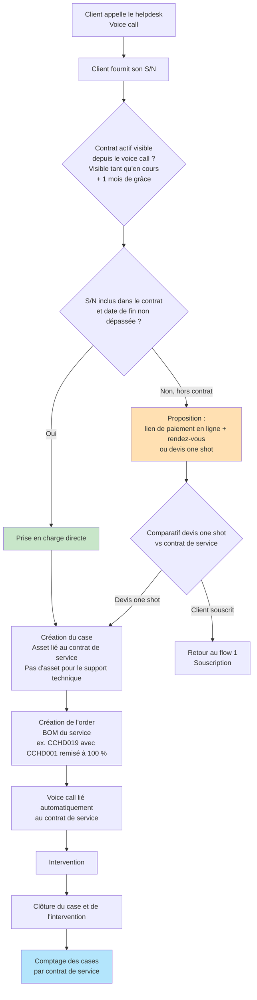

```mermaid
flowchart TD
    A["Client appelle le helpdesk<br/>Voice call"] --> B["Client fournit son S/N"]
    B --> C{"Contrat actif visible<br/>depuis le voice call ?<br/>Visible tant qu'en cours<br/>+ 1 mois de grâce"}
    C --> D{"S/N inclus dans le contrat<br/>et date de fin non dépassée ?"}

    D -->|"Oui"| E["Prise en charge directe"]
    E --> F["Création du case<br/>Asset lié au contrat de service<br/>Pas d'asset pour le support technique"]
    F --> G["Création de l'order<br/>BOM du service<br/>ex. CCHD019 avec CCHD001 remisé à 100 %"]
    G --> H["Voice call lié automatiquement<br/>au contrat de service"]
    H --> I["Intervention"]
    I --> J["Clôture du case et de l'intervention"]
    J --> K["Comptage des cases<br/>par contrat de service"]

    D -->|"Non, hors contrat"| L["Proposition :<br/>lien de paiement en ligne + rendez-vous<br/>ou devis one shot"]
    L --> M{"Comparatif devis one shot<br/>vs contrat de service"}
    M -->|"Client souscrit"| N["Retour au flow 1<br/>Souscription"]
    M -->|"Devis one shot"| F

    style E fill:#c8e6c9
    style L fill:#ffe0b2
    style K fill:#b3e5fc
```
