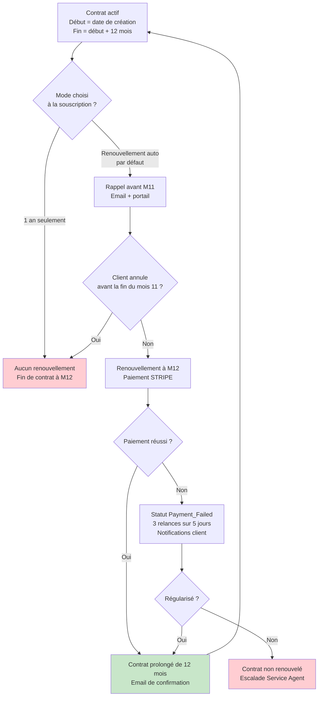

```mermaid
flowchart TD
    A["Contrat actif<br/>Début = date de création<br/>Fin = début + 12 mois"] --> B{"Mode choisi<br/>à la souscription ?"}
    B -->|"1 an seulement"| C["Aucun renouvellement<br/>Fin de contrat à M12"]
    B -->|"Renouvellement auto<br/>par défaut"| D["Rappel avant M11<br/>Email + portail"]
    D --> E{"Client annule<br/>avant la fin du mois 11 ?"}
    E -->|"Oui"| C
    E -->|"Non"| F["Renouvellement à M12<br/>Paiement STRIPE"]
    F --> G{"Paiement réussi ?"}
    G -->|"Oui"| H["Contrat prolongé de 12 mois<br/>Email de confirmation"]
    H --> A
    G -->|"Non"| I["Statut Payment_Failed<br/>3 relances sur 5 jours<br/>Notifications client"]
    I --> J{"Régularisé ?"}
    J -->|"Oui"| H
    J -->|"Non"| K["Contrat non renouvelé<br/>Escalade Service Agent"]

    style C fill:#ffcdd2
    style K fill:#ffcdd2
    style H fill:#c8e6c9
```
