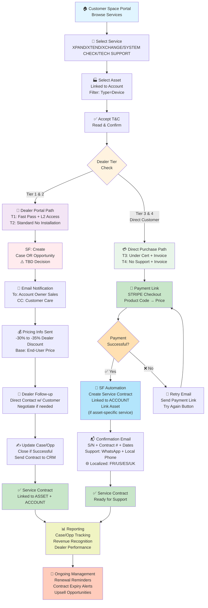

# Crée ou édite README.md
cat >> README.md << 'EOF'

## Payment Link Project Flow

```mermaid
flowchart TD
    A["🏠 Customer Space Portal<br/>Browse Services"] --> B["📱 Select Service<br/>XPAND/XTEND/XCHANGE/SYSTEM CHECK/TECH SUPPORT"]
    
    B --> C["🏭 Select Asset<br/>Linked to Account<br/>Filter: Type=Device"]
    
    C --> D["✅ Accept T&C<br/>Read & Confirm"]
    
    D --> E{Dealer Tier<br/>Check}
    
    E -->|Tier 1 & 2| F["📧 Dealer Portal Path<br/>T1: Fast Pass + L2 Access<br/>T2: Standard No Installation"]
    F --> F1["SF: Create<br/>Case OR Opportunity<br/>⚠️ TBD Decision"]
    F1 --> F2["📨 Email Notification<br/>To: Account Owner Sales<br/>CC: Customer Care"]
    F2 --> F3["💰 Pricing Info Sent<br/>-30% to -35% Dealer Discount<br/>Base: End-User Price"]
    F3 --> F4["👥 Dealer Follow-up<br/>Direct Contact w/ Customer<br/>Negotiate if needed"]
    F4 --> F5["✍️ Update Case/Opp<br/>Close if Successful<br/>Send Contract to CRM"]
    F5 --> END1["✅ Service Contract<br/>Linked to ASSET + ACCOUNT"]
    
    E -->|Tier 3 & 4<br/>Direct Customer| G["💳 Direct Purchase Path<br/>T3: Under Cert + Invoice<br/>T4: No Support + Invoice"]
    G --> G1["🔗 Payment Link<br/>STRIPE Checkout<br/>Product Code → Price"]
    G1 --> G2{Payment<br/>Successful?}
    G2 -->|✅ Yes| G3["🤖 SF Automation<br/>Create Service Contract<br/>Linked to ACCOUNT<br/>Link Asset<br/>(if asset-specific service)"]
    G2 -->|❌ No| G4["📧 Retry Email<br/>Send Payment Link<br/>Try Again Button"]
    G4 --> G1
    G3 --> G5["📬 Confirmation Email<br/>S/N + Contract # + Dates<br/>Support: WhatsApp + Local Phone<br/>🌐 Localized: FR/US/ES/UK"]
    G5 --> END2["✅ Service Contract<br/>Ready for Support"]
    
    END1 --> H["📊 Reporting<br/>Case/Opp Tracking<br/>Revenue Recognition<br/>Dealer Performance"]
    END2 --> H
    H --> I["🔄 Ongoing Management<br/>Renewal Reminders<br/>Contract Expiry Alerts<br/>Upsell Opportunities"]
    
    style A fill:#e1f5ff
    style E fill:#fff3e0
    style F fill:#f3e5f5
    style G fill:#e8f5e9
    style F1 fill:#ffebee
    style G1 fill:#c8e6c9
    style G2 fill:#ffe0b2
    style G3 fill:#b3e5fc
    style END1 fill:#c8e6c9
    style END2 fill:#c8e6c9
    style H fill:#f0f4c3
    style I fill:#ffccbc
```

EOF

git add README.md
git commit -m "Add Payment Link flowchart to README"
git push origin main
