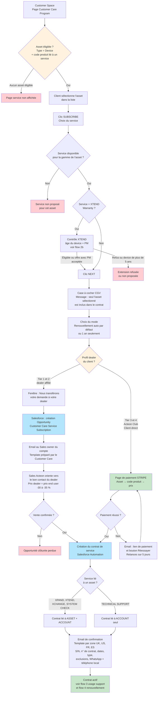

```mermaid
flowchart TD
    A["Customer Space<br/>Page Customer Care Program"] --> B{"Asset éligible ?<br/>Type = Device<br/>+ code produit lié à un service"}
    B -->|"Aucun asset éligible"| B1["Page service non affichée"]
    B -->|"Oui"| C["Client sélectionne l'asset<br/>dans la liste"]
    C --> D["Clic SUBSCRIBE<br/>Choix du service"]

    D --> E{"Service disponible<br/>pour la gamme de l'asset ?"}
    E -->|"Non"| E1["Service non proposé<br/>pour cet asset"]
    E -->|"Oui"| F{"Service = XTEND<br/>Warranty ?"}

    F -->|"Oui"| G["Contrôle XTEND<br/>âge du device + PM<br/>voir flow 2b"]
    G -->|"Éligible ou offre avec PM acceptée"| H
    G -->|"Refus ou device de plus de 5 ans"| G1["Extension refusée<br/>ou non proposée"]
    F -->|"Non"| H["Clic NEXT"]

    H --> I["Case à cocher CGV<br/>Message : seul l'asset sélectionné<br/>est inclus dans le contrat"]
    I --> J["Choix du mode<br/>Renouvellement auto par défaut<br/>ou 1 an seulement"]
    J --> K{"Profil dealer<br/>du client ?"}

    K -->|"Tier 1 et 2<br/>dealer affilié"| L["Fenêtre : Nous transférons<br/>votre demande à votre dealer"]
    L --> L1["Salesforce : création Opportunity<br/>Customer Care Service Subscription"]
    L1 --> L2["Email au Sales owner du compte<br/>Template préparé par le Customer Care"]
    L2 --> L3["Sales Acteon oriente vers<br/>le bon contact du dealer<br/>Prix dealer = prix end user -30 à -35 %"]
    L3 --> L4{"Vente confirmée ?"}
    L4 -->|"Non"| L5["Opportunité clôturée perdue"]
    L4 -->|"Oui"| M

    K -->|"Tier 3 et 4<br/>Acteon Club<br/>Client direct"| N["Page de paiement STRIPE<br/>Asset → code produit → prix"]
    N --> O{"Paiement réussi ?"}
    O -->|"Non"| O1["Email : lien de paiement<br/>et bouton Réessayer<br/>Relances sur 5 jours"]
    O1 --> N
    O -->|"Oui"| M

    M["Création du contrat de service<br/>Salesforce Automation"] --> P{"Service lié<br/>à un asset ?"}
    P -->|"XPAND, XTEND,<br/>XCHANGE, SYSTEM CHECK"| Q["Contrat lié à ASSET + ACCOUNT"]
    P -->|"TECHNICAL SUPPORT"| R["Contrat lié à ACCOUNT seul"]
    Q --> S
    R --> S["Email de confirmation<br/>Template par zone UK, US, FR, ES<br/>S/N, n° de contrat, dates, type,<br/>exclusions, WhatsApp + téléphone local"]
    S --> T["Contrat actif<br/>voir flow 3 usage support<br/>et flow 4 renouvellement"]

    style B fill:#fff3e0
    style K fill:#fff3e0
    style L1 fill:#b3e5fc
    style M fill:#b3e5fc
    style N fill:#c8e6c9
    style T fill:#c8e6c9
    style B1 fill:#ffcdd2
    style E1 fill:#ffcdd2
    style G1 fill:#ffcdd2
    style L5 fill:#ffcdd2
```
