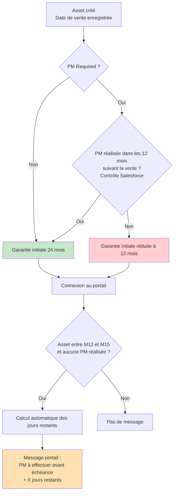

```mermaid
flowchart TD
    A["Asset créé<br/>Date de vente enregistrée"] --> B{"PM Required ?"}
    B -->|"Non"| C["Garantie initiale 24 mois"]
    B -->|"Oui"| D{"PM réalisée dans les 12 mois<br/>suivant la vente ?<br/>Contrôle Salesforce"}
    D -->|"Oui"| C
    D -->|"Non"| E["Garantie initiale réduite à 12 mois"]

    C --> F["Connexion au portail"]
    E --> F
    F --> G{"Asset entre M12 et M15<br/>et aucune PM réalisée ?"}
    G -->|"Oui"| H["Calcul automatique des jours restants"]
    H --> I["Message portail :<br/>PM à effectuer avant échéance<br/>+ X jours restants"]
    G -->|"Non"| J["Pas de message"]

    style C fill:#c8e6c9
    style E fill:#ffcdd2
    style I fill:#ffe0b2
```
