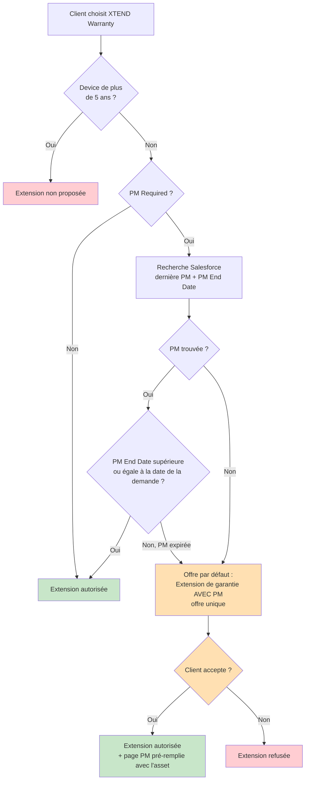

```mermaid
flowchart TD
    A["Client choisit XTEND Warranty"] --> B{"Device de plus<br/>de 5 ans ?"}
    B -->|"Oui"| B1["Extension non proposée"]
    B -->|"Non"| C{"PM Required ?"}
    C -->|"Non"| OK["Extension autorisée"]
    C -->|"Oui"| D["Recherche Salesforce<br/>dernière PM + PM End Date"]
    D --> E{"PM trouvée ?"}
    E -->|"Oui"| F{"PM End Date supérieure<br/>ou égale à la date de la demande ?"}
    E -->|"Non"| L
    F -->|"Oui"| OK
    F -->|"Non, PM expirée"| L

    L["Offre par défaut :<br/>Extension de garantie AVEC PM<br/>offre unique"] --> N{"Client accepte ?"}
    N -->|"Oui"| O["Extension autorisée<br/>+ page PM pré-remplie avec l'asset"]
    N -->|"Non"| P["Extension refusée"]

    style OK fill:#c8e6c9
    style O fill:#c8e6c9
    style B1 fill:#ffcdd2
    style P fill:#ffcdd2
    style L fill:#ffe0b2
    style N fill:#ffe0b2
```
